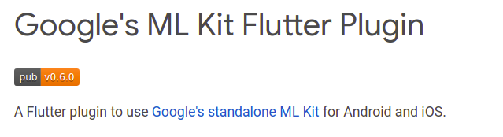
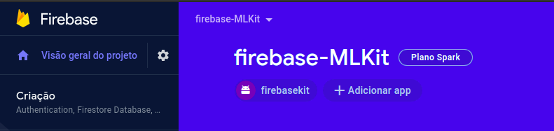

# Firebase ML Kit + Flutter 

<h2><strong>Instituto Federal de Ciência e Tecnologia de São Paulo</strong> - Desenvolvimento para Dispositivos Móveis</h2>

<h3 align="center">App de Machine Learning - Flutter + ML Kit para Firebase :fire:</h3>

A relação do Machine Learning, que chamamos aprendizado de máquina, e aplicações mobile estão cada vez mais próximas. A aplicação dessas tecnologias pode garantir a melhoria na experiência do usuário, desde a interface, acessibilidade e usabilidade até segurança.
O kit ML disponibilizado pelo Firebase oferece ferramentas que tornam a aplicação inteligente e acessivel com Google Cloud Platform como base na nuvem. Reconhecimento visual, detecção de imagem, linguagem nativa e tradução, entre opções customizaveis
<ul>
<li>Reconhecimento de texto :iphone: :cloud:</li>
<li>Detecção facial :iphone:</li>
<li>Scanner de códigos :iphone:</li>
<li>Marcação de imagem :iphone: :cloud:</li>
<li>Detecção e monitoramento de Objeto :iphone:</li>
<li>Reconhecimento de marca :cloud:</li>
<li>Identificação de linguagem :iphone:</li>
<li>Tradução :iphone:</li>
<li>Resposta inteligênte :iphone:</li>
<li>AutoML model inference* :iphone:</li>
<li>Custom model inference* :iphone:</li>
</ul>
Mais informações em <a href="https://pub.dev/packages/google_ml_kit">Google ML Kit</a>
 

  

 
Para iniciar um projeto é necessário acessar o <a href="console.firebase.google.com">Console Firebase</a>, lá é possivel encontrar diversos recursos do Firebase.
É necessário registrar o projeto através da página inicial e baixar o arquivo <strong>google-services.json</strong>, para finalizar adicionar o <strong>SDK</strong> do Firebase.
 

  

 
Após esses passos fica por conta do código baixar as dependências, importa-las no projeto.

  

<h4 align="right">:arrow_down: Para mais informações sobre o <strong>Flutter</strong><h4>

## Getting Started

This project is a starting point for a Flutter application.
A few resources to get you started if this is your first Flutter project:

- [Lab: Write your first Flutter app](https://flutter.dev/docs/get-started/codelab)
- [Cookbook: Useful Flutter samples](https://flutter.dev/docs/cookbook)

For help getting started with Flutter, view our
[online documentation](https://flutter.dev/docs), which offers tutorials,
samples, guidance on mobile development, and a full API reference.

Introdução
Trabalho 